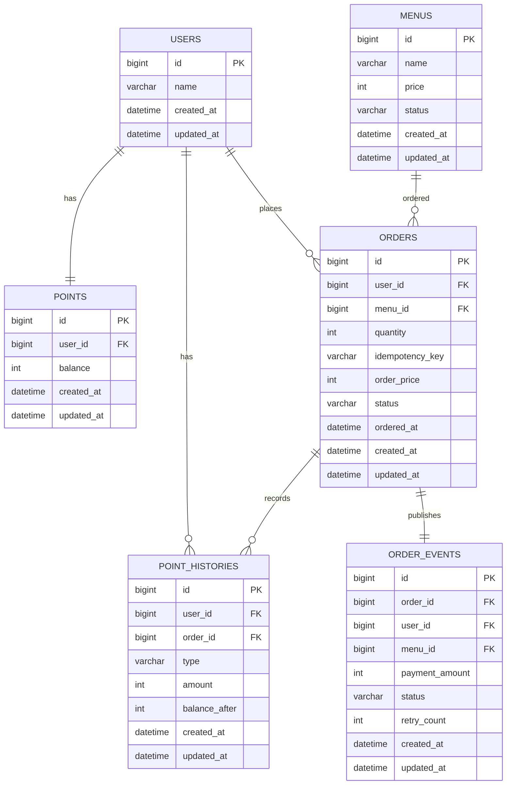

# Coffee Order System

## 1. 설계 의도

초기 구현은 단일 애플리케이션 인스턴스로 운영하되, 다수 서버 환경으로 확장해도 정합성을 유지할 수 있는 커피숍 주문 시스템을 설계하고 구현하는 것을 목표로 한다.

사용자는 커피 메뉴를 조회하고, 포인트를 충전한 뒤 포인트로 커피를 주문 및 결제할 수 있다.

주문이 완료되면 주문 내역은 데이터 수집 플랫폼으로 실시간 전송되어야 하며, 최근 7일간의 주문 내역을 기준으로 인기 메뉴 3개를 조회할 수 있어야 한다.

이 과제에서 중요하게 보는 지점은 단순 CRUD가 아니라 다음 항목이라고 판단했다.

- 포인트 충전 및 사용 시 동시성 제어
- 주문, 결제, 포인트 차감 간 데이터 일관성
- 다중 서버 환경에서 동일한 데이터 기준 유지
- 주문 데이터 실시간 전송 실패에 대한 대응
- 최근 7일 인기 메뉴 집계의 정확성
- 기능 및 제약사항에 대한 테스트

인증/인가 기능은 요구사항에 포함되어 있지 않으므로 구현 범위에서 제외한다. API 요청 시 사용자 식별값을 직접 전달받아 주문과 포인트 처리를 수행한다. 실제 서비스로 확장할 경우 OAuth 또는 JWT 인증을 추가하고, 요청 사용자 식별값을 인증 컨텍스트에서 가져오도록 변경할 수 있다.

## 2. 문제 해결 전략 및 분석 내용

### 2.1 포인트 잔액과 이력 분리

포인트 잔액은 `points`에서 관리하고, 충전 및 사용 내역은 `point_histories`에 별도로 저장한다.

사용자의 현재 잔액만 저장하면 포인트가 왜 변경되었는지 추적하기 어렵다. 따라서 잔액 테이블과 이력 테이블을 분리하여 현재 상태 조회와 변경 근거 추적을 모두 가능하게 한다.

### 2.2 주문과 결제의 트랜잭션 처리

주문 결제 시 다음 작업은 하나의 트랜잭션 안에서 처리한다.

- 포인트 잔액 차감
- 주문 저장
- 포인트 사용 이력 저장
- 주문 이벤트 저장

이 중 하나라도 실패하면 전체 트랜잭션을 롤백한다. 이를 통해 주문은 생성됐지만 포인트가 차감되지 않거나, 포인트는 차감됐지만 주문이 생성되지 않는 상황을 방지한다.

### 2.3 주문/결제 멱등성 전략

주문/결제 API는 클라이언트 재시도 상황에서 중복 주문과 중복 포인트 차감을 방지해야 한다.

예를 들어 클라이언트가 주문 요청을 보낸 뒤 네트워크 타임아웃으로 응답을 받지 못하면 같은 요청을 다시 보낼 수 있다. 이때 멱등성 처리가 없으면 포인트가 두 번 차감되고 주문도 두 번 생성될 수 있다.

이를 방지하기 위해 주문/결제 API는 `Idempotency-Key` 헤더를 받는다. 서버는 `userId + idempotencyKey` 조합으로 기존 주문을 먼저 확인한다.

처리 방식은 다음과 같다.

1. `userId + Idempotency-Key`로 기존 주문을 조회한다.
2. 이미 처리된 주문이 있으면 새 주문을 만들지 않고 기존 주문 결과를 반환한다.
3. 기존 주문이 없으면 주문과 결제를 진행한다.
4. 주문 저장 시 `idempotency_key`를 함께 저장한다.
5. 동시에 같은 키가 들어오면 `user_id`, `idempotency_key` 유니크 제약으로 중복 주문을 방지한다.

멱등성 키는 조회 API에는 적용하지 않는다. 포인트 차감이 발생하는 주문/결제 API에 우선 적용한다. 키는 필수이고 공백일 수 없으며, `orders.idempotency_key VARCHAR(100)` 제약과 일치하게 최대 100자만 허용한다. 101자 이상 키는 주문·포인트·사용 이력·Outbox 저장 전에 HTTP 400 공통 오류로 거부한다.

지원하지 않는 주문 API HTTP 메서드는 405, 지원하지 않는 Content-Type은 415 공통 오류 응답으로 반환한다. 예상하지 못한 서버 예외는 내부 상세를 응답에 포함하지 않는 500 공통 오류로 반환하고 ERROR 로그로 원인을 남긴다.

### 2.4 동시성 제어 전략

동일 사용자가 동시에 여러 주문을 요청하면 같은 잔액을 기준으로 중복 차감이 발생할 수 있다.

예를 들어 10,000P를 가진 사용자가 6,000P 메뉴를 동시에 2번 주문하면, 동시성 제어가 없을 경우 두 주문이 모두 성공하여 잔액이 음수가 될 수 있다.

이를 방지하기 위해 충전과 주문 결제 모두 `users` row를 먼저, 기존 `points` row를 다음으로 DB 비관적 락으로 읽는다. MySQL `REPEATABLE-READ`에서 사용자 잠금 대기 뒤에도 최신 포인트를 읽도록 `points` 조회는 locking read를 사용한다.

본 과제에서는 포인트 차감 대상이 사용자별 `points` row로 명확하다. 따라서 Redis 분산락보다 DB 비관적 락이 더 단순하고, 트랜잭션과 함께 설명하기 쉽다고 판단했다.

#### Redis 락과 DB 비관적 락 비교

| 항목 | DB 비관적 락 | Redis 분산락 |
| --- | --- | --- |
| 락 기준 | 실제 포인트 잔액 row | Redis key |
| 다중 서버 지원 | 공통 DB를 바라보므로 가능 | 공통 Redis를 바라보면 가능 |
| 트랜잭션 연계 | DB 트랜잭션과 자연스럽게 묶임 | DB 트랜잭션과 별도 관리 필요 |
| 장애 고려 | DB 장애 시 쓰기 작업 중단 | Redis 장애, TTL 만료, 락 해제 실패 고려 필요 |
| 구현 난이도 | 상대적으로 단순 | 상대적으로 높음 |
| 본 과제 선택 | 선택 | 비교 대상으로만 고려 |

#### 비관적 락 적용 예시

```java
@Lock(LockModeType.PESSIMISTIC_WRITE)
@Query("select point from Point point where point.user.id = :userId")
Optional<Point> findByUserIdWithPessimisticLock(Long userId);
```

### 2.5 Outbox 기반 주문 완료 이벤트 발행 전략

주문 성공 후 데이터 수집 플랫폼으로 사용자 식별값, 메뉴 ID, 결제 금액을 전송해야 한다.

또한 주문 완료 이벤트는 인기 메뉴 랭킹과 결제 히스토리 기록에서도 사용할 수 있다. 하나의 주문 완료 이벤트를 Kafka topic으로 발행하고, 목적이 다른 Consumer Group들이 같은 이벤트를 각각 소비하도록 설계한다.

```text
주문/결제 성공
-> order_events에 PENDING 이벤트 저장
-> Outbox Publisher가 Kafka topic(order-paid)에 주문 완료 이벤트 발행
-> product-ranking-group: Redis ZSET에 메뉴별 주문 수 누적
-> data-platform-group: DataPlatformClient를 통해 외부 데이터 수집 플랫폼으로 HTTP 요청 전송
```

데이터 플랫폼 Consumer는 `data-platform-group`으로 같은 `order-paid` 토픽을 랭킹 Consumer와 독립적으로 소비한다. `DataPlatformClient`를 통해 외부 데이터 수집 플랫폼으로 HTTP 요청을 전송하도록 구현하였다. 과제에서는 Mock API 사용을 전제로 설계하였으며, 현재 프로젝트에서는 외부 시스템 연동을 `DataPlatformClient`로 추상화하였다.

HTTP 요청 본문에는 `eventId`, `userId`, `menuId`, `paymentAmount`를 넣고 `Idempotency-Key: order-paid:{eventId}`를 함께 보낸다. HTTP 2xx만 성공이며, 연결 실패·timeout·5xx는 `DATA_PLATFORM_CONSUMER_MAX_RETRY_ATTEMPTS`만큼 재시도한 뒤 `DATA_PLATFORM_CONSUMER_DLT_TOPIC`으로 보낸다. 4xx는 재시도하지 않는다. HTTP 성공 뒤 offset 기록 전 중단되면 같은 요청이 다시 전송될 수 있으므로 수신 플랫폼은 이 키로 논리적 단건 수집을 보장해야 한다.

### 2.6 인기 메뉴 조회 전략

인기 메뉴는 주문 완료 이벤트를 Kafka로 발행한 뒤, `product-ranking-group` Consumer가 이벤트를 소비하여 Redis ZSET에 메뉴별 주문 수를 누적하는 방식으로 구현한다.

Redis에는 일자별 랭킹 키를 저장한다.

```text
coffee:ranking:2026-07-12
member: menuId
score: 주문 횟수
```

최근 7일 인기 메뉴 조회 시에는 최근 7일의 일자별 ZSET을 합산하여 상위 3개 메뉴를 반환한다.

일자별 Redis 키는 `OrderPaidEvent.orderedAt`을 Asia/Seoul 날짜로 변환해 선택하므로, Kafka 지연은 7일 집계의 주문일을 바꾸지 않는다.

```text
coffee:ranking:{yyyy-MM-dd} 7개 키
-> ZUNIONSTORE 또는 애플리케이션 합산
-> score 내림차순 상위 3개 조회
```

각 일자에는 다음 파생 키도 함께 둔다.

```text
coffee:ranking:count:{yyyy-MM-dd}       Consumer 처리 주문 건수
coffee:ranking:status:{yyyy-MM-dd}      DATA 또는 EMPTY
coffee:ranking:processed:{eventId}      중복 소비 marker
```

Redis ZSET을 사용하는 이유는 인기 메뉴 조회가 자주 호출될 수 있고, 매번 `orders` 테이블을 집계하면 데이터가 많아질수록 조회 비용이 커지기 때문이다. Redis는 메뉴별 주문 수 증가와 상위 랭킹 조회에 적합하다.

`order-paid` Consumer는 `product-ranking-group`으로 메시지를 소비한다. 일자별 랭킹·상태·count 키의 날짜는 Consumer 처리 시각이 아니라 이벤트 `orderedAt`을 Asia/Seoul 날짜로 변환한 값이다. 따라서 자정 이후의 지연 소비나 재소비도 원장 주문일에 반영된다. 동시성, 키·마커 TTL, 재시도 횟수와 DLT 토픽은 `RANKING_CONSUMER_*`, `RANKING_REDIS_KEY_TTL` 환경 변수로 설정한다. Redis 재구성 잠금은 `RANKING_REDIS_REBUILD_LOCK_TTL`, 주기적 lease 연장은 이보다 짧아야 하는 `RANKING_REDIS_REBUILD_LOCK_RENEW_INTERVAL`로 분리한다. `.env.example`은 3개 파티션을 병렬 처리하도록 동시성 3, 잠금 TTL `PT1M`, 연장 주기 `PT20S`를 예시로 제공한다. 새 eventId의 중복 마커, `coffee:ranking:{yyyy-MM-dd}` ZSET 점수, 일자별 count 증가, `DATA` 상태와 TTL은 `src/main/resources/scripts/ranking-process-once.lua`의 한 Redis Lua로 원자 처리하므로 Kafka 재전달도 점수와 처리 건수를 중복 증가시키지 않는다. 스크립트는 애플리케이션 시작 시 classpath resource에서 한 번 로드한다. 이벤트 한 건은 주문 수량이 아니라 주문 횟수 1건으로 집계한다.

다만 Redis 랭킹은 실시간 조회 최적화 용도이다. 정확한 주문 원장은 `orders` 테이블이며, Redis 처리 count와 일자별 `PAID` 주문 건수가 하나라도 다르면 Redis 결과를 신뢰하지 않는다. 인기 메뉴 조회는 Asia/Seoul 기준 요청일 포함 7개 달력일의 ZSET·상태·count를 하나의 Lua snapshot으로 읽은 뒤, 동일 `REQUIRES_NEW`·읽기 전용·`REPEATABLE_READ` DB snapshot에서 `orders`를 집계한다. 모두 일치하고 상태가 완전할 때만 Redis 랭킹을 반환하며, 불일치·부분 유실이면 기존 재구성 잠금을 사용한다. 다른 인스턴스가 잠금을 보유한 경우에도 오래된 Redis 대신 DB snapshot 결과를 응답한다. 재구성의 `PAID` 일자 집계와 Outbox marker 조회는 같은 DB snapshot에서 수행하고, 일자별 ZSET·count·`DATA/EMPTY` 상태를 함께 복원한다.

정확성 검증 또는 복구 기준 쿼리는 다음과 같다.

```sql
select
    date(o.ordered_at) as ordered_date,
    o.menu_id,
    count(o.id) as order_count
from orders o
where o.status = 'PAID'
  and o.ordered_at >= :start
  and o.ordered_at < :end
group by date(o.ordered_at), o.menu_id;
```

### 2.7 다중 서버 및 고가용성 확장 전략

현재 구현은 애플리케이션 서버 1대와 단일 MySQL·Redis·Kafka Broker를 사용한다. 이후 애플리케이션 서버를 여러 대로 늘릴 때도 모든 인스턴스가 같은 MySQL과 Redis를 바라보도록 구성한다. 서버별로 데이터 저장소가 분리되면 주문, 포인트, 인기 메뉴 집계 결과가 달라질 수 있기 때문이다.

다만 단일 MySQL 또는 단일 Redis 인스턴스만 사용하면 해당 인스턴스 장애가 전체 서비스 장애로 이어질 수 있다. 운영 환경에서는 다음 구성을 고려한다.

| 구성 요소 | 초기 구현 | 운영 환경 고려 |
| --- | --- | --- |
| Application Server | 1 인스턴스 | 로드밸런서를 통한 다중 인스턴스 트래픽 분산 |
| MySQL | 단일 인스턴스 | Primary-Replica 구조, 장애 시 Failover |
| Redis | 단일 인스턴스 | Redis Sentinel 또는 Redis Cluster |
| Kafka | 단일 Broker에서 주문 완료 이벤트 발행 | Broker 3대 이상 구성 |

MySQL은 쓰기 작업이 필요한 주문, 포인트 충전, 포인트 차감은 Primary에서 처리하고, 메뉴 조회나 인기 메뉴 조회 같은 읽기 요청은 Replica로 분산할 수 있다. 다만 주문 직후 즉시 반영되어야 하는 데이터는 복제 지연을 고려해 Primary를 조회하거나 정합성 요구 수준에 따라 조회 전략을 분리한다.

Outbox Publisher를 다중 애플리케이션 서버 환경으로 확장할 때는, 서버 간 clock skew로 인한 조기 회수 또는 회수 지연을 막기 위해 lease 선점과 갱신 기준을 DB 시간 또는 UTC `Instant`로 통일해야 한다.

## 3. 기술 선택 이유

| 기술 | 선택 이유 |
| --- | --- |
| Spring Boot | REST API 서버를 빠르게 구성하고 계층형 구조로 비즈니스 로직을 분리하기 적합하다. |
| Spring Data JPA | 도메인 중심으로 엔티티를 설계하고, 트랜잭션과 락을 선언적으로 관리하기 적합하다. |
| MySQL | 주문, 포인트, 이력 데이터처럼 정합성이 중요한 데이터를 저장하기 적합하다. |
| DB 비관적 락 | 다중 서버 환경에서도 공통 DB row를 기준으로 포인트 차감 동시성을 제어할 수 있다. |
| Redis | Kafka Consumer가 소비한 주문 완료 이벤트를 ZSET에 누적하여 최근 7일 인기 메뉴를 빠르게 조회하기 위해 사용한다. |
| Kafka | 주문 완료 이벤트를 발행하고, 인기 랭킹/히스토리/데이터 수집 Consumer가 같은 이벤트를 독립적으로 소비하도록 사용한다. |
| Outbox Pattern | 주문 저장과 이벤트 저장을 같은 트랜잭션으로 묶어 이벤트 유실 가능성을 줄인다. |
| DLT | Kafka Consumer 처리 실패 메시지를 별도 토픽으로 분리하여 재처리할 수 있도록 한다. |
| JUnit5 | 주요 비즈니스 로직과 예외 케이스를 검증한다. |
| Testcontainers | MySQL, Redis, Kafka 등 실제 인프라에 가까운 통합 테스트 환경을 구성할 수 있다. |
| K6 | 주문, 메뉴 조회, 인기 메뉴 조회 API의 성능 테스트에 활용한다. |

## 4. 설계 내용

### 4.1 ERD



### 4.2 테이블 설계

모든 엔티티는 `BaseEntity`를 상속하여 생성 시각과 수정 시각을 공통으로 관리한다.

| 컬럼 | DB 타입 | Java 타입 | 설명 |
| --- | --- | --- | --- |
| created_at | DATETIME | LocalDateTime | 생성 시각 |
| updated_at | DATETIME | LocalDateTime | 수정 시각 |

#### users

사용자 식별 정보를 저장한다. 로그인 기능은 구현하지 않지만, 포인트와 주문의 주체를 구분하기 위해 사용자 테이블은 필요하다.

| 컬럼 | DB 타입 | Java 타입 | 설명 |
| --- | --- | --- | --- |
| id | BIGINT | Long | 사용자 ID |
| name | VARCHAR | String | 사용자 이름 |
| created_at | DATETIME | LocalDateTime | 생성 시각 |
| updated_at | DATETIME | LocalDateTime | 수정 시각 |

#### menus

메뉴 정보를 저장한다.

| 컬럼 | DB 타입 | Java 타입 | 설명 |
| --- | --- | --- | --- |
| id | BIGINT | Long | 메뉴 ID |
| name | VARCHAR | String | 메뉴명 |
| price | INT | Integer | 가격 |
| status | VARCHAR | MenuStatus | ACTIVE, SOLD_OUT |
| created_at | DATETIME | LocalDateTime | 생성 시각 |
| updated_at | DATETIME | LocalDateTime | 수정 시각 |

#### points

사용자의 현재 포인트 잔액을 저장한다. 주문 결제 시 동시성 제어를 위해 사용자별 row에 비관적 락을 적용한다.

| 컬럼 | DB 타입 | Java 타입 | 설명 |
| --- | --- | --- | --- |
| id | BIGINT | Long | 포인트 ID |
| user_id | BIGINT | Long | 사용자 ID |
| balance | INT | Integer | 현재 포인트 잔액 |
| created_at | DATETIME | LocalDateTime | 생성 시각 |
| updated_at | DATETIME | LocalDateTime | 수정 시각 |

#### point_histories

포인트 충전 및 사용 이력을 저장한다.

| 컬럼 | DB 타입 | Java 타입 | 설명 |
| --- | --- | --- | --- |
| id | BIGINT | Long | 포인트 이력 ID |
| user_id | BIGINT | Long | 사용자 ID |
| order_id | BIGINT | Long | 주문 ID, 충전 이력은 null 가능 |
| type | VARCHAR | PointHistoryType | CHARGE, USE |
| amount | INT | Integer | 변동 포인트 |
| balance_after | INT | Integer | 반영 후 잔액 |
| created_at | DATETIME | LocalDateTime | 생성 시각 |
| updated_at | DATETIME | LocalDateTime | 수정 시각 |

#### orders

커피 주문 및 결제 결과를 저장한다.

| 컬럼 | DB 타입 | Java 타입 | 설명 |
| --- | --- | --- | --- |
| id | BIGINT | Long | 주문 ID |
| user_id | BIGINT | Long | 사용자 ID |
| menu_id | BIGINT | Long | 메뉴 ID |
| quantity | INT | Integer | 주문 수량, 1 이상 |
| idempotency_key | VARCHAR | String | 주문/결제 중복 요청 방지 키 |
| order_price | INT | Integer | 주문 시점 메뉴 가격과 수량을 곱한 총 결제금액 |
| status | VARCHAR | OrderStatus | PAID |
| ordered_at | DATETIME | LocalDateTime | 주문 시각 |
| created_at | DATETIME | LocalDateTime | 생성 시각 |
| updated_at | DATETIME | LocalDateTime | 수정 시각 |

동일 사용자가 같은 멱등성 키로 주문을 중복 요청하지 못하도록 `user_id`, `idempotency_key`에 유니크 제약을 설정한다.

#### order_events

데이터 수집 플랫폼으로 전송할 주문 이벤트를 저장한다. `order_id` 유니크 제약으로 주문 1건과 Outbox 이벤트 1건을 일대일로 연결한다.

| 컬럼 | DB 타입 | Java 타입 | 설명 |
| --- | --- | --- | --- |
| id | BIGINT | Long | 이벤트 ID |
| order_id | BIGINT | Long | 주문 ID |
| user_id | BIGINT | Long | 사용자 ID |
| menu_id | BIGINT | Long | 메뉴 ID |
| payment_amount | INT | Integer | 결제 금액 |
| status | VARCHAR | OrderEventStatus | PENDING |
| retry_count | INT | Integer | 재시도 횟수 |
| processing_started_at | DATETIME | LocalDateTime | 선점 시작 시각 |
| next_attempt_at | DATETIME | LocalDateTime | 다음 발행 가능 시각 |
| processing_token | VARCHAR | String | Publisher 선점 토큰 |
| last_error | VARCHAR | String | 마지막 Kafka 발행 실패 사유 |
| created_at | DATETIME | LocalDateTime | 생성 시각 |
| updated_at | DATETIME | LocalDateTime | 수정 시각 |

### 4.3 API 명세서

#### 커피 메뉴 목록 조회 API

```http
GET /api/menus
```

성공 응답 예시:

```json
{
  "status": 200,
  "message": "요청이 성공했습니다.",
  "data": [
    {
      "menuId": 1,
      "name": "아메리카노",
      "price": 4500
    }
  ]
}
```

<br/>

#### 포인트 충전 API

```http
POST /api/points/charge
```

`local` 프로필은 로컬 전용 Flyway V3 migration으로 Postman 검증용 사용자(`userId: 1`)를 등록한다. 공통 migration은 스키마와 메뉴 기준 데이터만 포함하므로 로컬이 아닌 환경에는 이 사용자가 새로 생성되지 않는다. 이전에 V3가 적용된 로컬이 아닌 DB는 V3 하나만 missing legacy migration으로 허용해 migrate하며, 기존 사용자 row를 삭제하거나 변경하지 않는다. 다른 versioned migration 누락은 오류로 처리한다.

요청:

```json
{
  "userId": 1,
  "amount": 10000
}
```

충전 후 잔액은 `Integer.MAX_VALUE`(2,147,483,647)를 초과할 수 없다. 초과 요청은 잔액과 충전 이력을 변경하지 않고 HTTP 400으로 실패한다.

성공 응답 예시:

```json
{
  "status": 200,
  "message": "요청이 성공했습니다.",
  "data": {
    "userId": 1,
    "chargedAmount": 10000,
    "balance": 10000
  }
}
```

실패 응답 예시(0 이하):

```json
{
  "status": 400,
  "message": "충전 금액은 1 이상이어야 합니다."
}
```

실패 응답 예시(100,000 초과):

```json
{
  "status": 400,
  "message": "충전 금액은 100,000 이하여야 합니다."
}
```

실패 응답 예시(잔액 최대값 초과):

```json
{
  "status": 400,
  "message": "포인트 잔액은 최대 2,147,483,647까지 충전할 수 있습니다."
}
```
<br/>

#### 커피 주문 및 결제 API

```http
POST /api/orders
Idempotency-Key: 7f4f0c2e-2d3e-4b1f-9e45-aaaa1111bbbb
```

요청:

```json
{
  "userId": 1,
  "menuId": 1,
  "quantity": 2
}
```

성공 응답 예시:

```json
{
  "status": 201,
  "message": "주문 및 결제가 성공적으로 완료되었습니다.",
  "data": {
    "orderId": 1,
    "userId": 1,
    "menuId": 1,
    "quantity": 2,
    "paymentAmount": 9000,
    "remainingPoint": 1000,
    "status": "PAID"
  }
}
```

실패 응답 예시:

```json
{
  "status": 400,
  "message": "포인트가 부족합니다."
}
```

`quantity`는 1 이상의 정수다. 결제 금액은 주문 시점 메뉴 가격과 수량의 곱이며 `orders.order_price`, 포인트 사용 이력, Outbox의 결제금액에 같은 총액으로 저장된다. 동일 사용자·동일 `Idempotency-Key`로 같은 메뉴와 수량을 재요청하면 기존 주문 결과를 반환하며 포인트를 중복 차감하지 않는다. 이때 `remainingPoint`는 주문의 `USE` 이력에 저장한 차감 후 잔액으로 복원한다. 같은 키에 다른 메뉴 또는 수량을 사용하면 HTTP 409으로 실패한다. 주문 성공 시 `orders`, 포인트 차감, `point_histories`의 `USE` 이력, `order_events`의 `PENDING` 이벤트가 하나의 트랜잭션으로 저장된다. Kafka 발행은 요청 트랜잭션 밖의 Scheduler가 처리하므로 Kafka 장애가 주문 API를 롤백하지 않는다.
<br/>

#### 인기 메뉴 목록 조회 API

```http
GET /api/menus/popular
```

성공 응답 예시:

```json
{
  "status": 200,
  "message": "요청이 성공했습니다.",
  "data": [
    {
      "menuId": 1,
      "rank": 1,
      "menuName": "아메리카노",
      "orderCount": 25
    }
  ]
}
```

Asia/Seoul 기준 요청일을 포함한 최근 7개 달력일의 일자별 Redis ZSET 점수를 메뉴별로 합산한다. 조회 시 ZSET·`DATA/EMPTY` 상태·count를 하나의 원자 snapshot으로 읽고, `orders.ordered_at`의 시작일 00:00 이상·요청 다음 날 00:00 미만 범위에서 `PAID` 주문 건수를 일자별로 비교한다. 모두 일치하면 Redis 랭킹을 사용하고, 하나라도 다르면 재구성 잠금을 사용해 DB 원장으로 복구한다. Redis 연결 실패, 명령 실행 실패 또는 명령 timeout이 발생하면 재구성 lock·lease·write를 추가로 시도하지 않고 해당 DB 원장 집계 결과를 반환한다. DB 원장 조회 실패는 fallback으로 숨기지 않고 공통 오류 처리 정책을 따른다. 응답은 복구 성공 여부와 관계없이 해당 DB snapshot 결과를 사용한다. 정렬은 주문 횟수 내림차순, 동점이면 숫자 메뉴 ID 오름차순이다. 현재 `ACTIVE` 메뉴만 최대 3건 반환하며 제외된 메뉴는 다음 ACTIVE 메뉴로 보충한다. 주문이 없는 날짜는 count `0`과 `EMPTY` 상태로 기록한다.

## 5. 공통 응답 및 예외 처리

### 5.1 공통 응답

모든 API는 응답 본문에 `status`, `message`를 포함한다. 성공 응답에는 처리 결과를 `data`로 추가하고, 실패 응답에는 `data`를 포함하지 않는다.

성공 응답 예시:

```json
{
  "status": 200,
  "message": "요청이 성공했습니다.",
  "data": {}
}
```

실패 응답 예시:

```json
{
  "status": 400,
  "message": "포인트가 부족합니다."
}
```

| 필드 | 설명 |
| --- | --- |
| status | HTTP 상태 코드 |
| message | 요청 처리 결과 메시지 |
| data | 성공 응답 데이터 |

### 5.2 예외 처리

예외 코드는 서버 내부 `ErrorCode` enum과 예외 처리 분기에서만 사용한다. 실패 응답 JSON에는 예외 코드를 포함하지 않고 `status`, `message`만 반환한다.

| 상황 | 내부 ErrorCode | HTTP Status | 설명 |
| --- | --- | --- | --- |
| 사용자 ID 누락 | INVALID_USER_ID | 400 | 사용자 ID가 필수값이 아님 |
| 존재하지 않는 사용자 | USER_NOT_FOUND | 404 | 요청한 사용자 ID가 존재하지 않음 |
| 메뉴 ID 누락 | INVALID_MENU_ID | 400 | 메뉴 ID가 필수값이 아님 |
| 존재하지 않는 메뉴 | MENU_NOT_FOUND | 404 | 요청한 메뉴 ID가 존재하지 않음 |
| 판매 중이 아닌 메뉴 | MENU_NOT_ON_SALE | 400 | 품절 또는 숨김 상태 메뉴 |
| 주문 수량 오류 | INVALID_ORDER_QUANTITY | 400 | 수량이 1 미만이거나 결제 금액이 표현 범위를 초과함 |
| 충전 금액 오류 | INVALID_CHARGE_AMOUNT | 400 | 충전 금액이 1 미만 또는 100,000 초과 |
| 포인트 잔액 초과 | POINT_BALANCE_OVERFLOW | 400 | 충전 후 잔액이 `Integer.MAX_VALUE`를 초과함 |
| 포인트 정보 없음 | POINT_NOT_FOUND | 404 | 주문 시 사용자 포인트 정보가 없음 |
| 잔액 부족 | INSUFFICIENT_POINT | 400 | 포인트 잔액이 주문 금액보다 작음 |
| 멱등성 키 누락 | IDEMPOTENCY_KEY_REQUIRED | 400 | 주문 요청에 멱등성 키가 없음 |
| 멱등성 키 길이 초과 | IDEMPOTENCY_KEY_TOO_LONG | 400 | Idempotency-Key가 100자를 초과함 |
| 멱등성 키 충돌 | IDEMPOTENCY_KEY_CONFLICT | 409 | 같은 멱등성 키로 다른 요청 내용이 들어옴 |
| Outbox 이벤트 없음 | OUTBOX_EVENT_NOT_FOUND | 404 | 요청한 Outbox 이벤트가 존재하지 않음 |
| Outbox 이벤트 재처리 불가 | OUTBOX_EVENT_NOT_REPROCESSABLE | 409 | FAILED 상태가 아닌 Outbox 이벤트의 재처리를 요청함 |
| 서버 내부 오류 | INTERNAL_SERVER_ERROR | 500 | 서버 내부 오류 |

주문 이벤트 전송 실패는 주문 자체를 실패시키지 않는다. 주문 이벤트가 이미 `order_events` 테이블에 저장되어 있다면 재시도 가능한 상태로 관리한다.

## 6. 테스트 전략

### 6.1 단위 테스트

- 포인트 충전 성공
- 최대 잔액 경계 충전 성공과 초과 충전의 잔액·이력 무변경
- 0 이하 금액 충전 실패
- 주문 결제 성공
- 동일 멱등성 키로 주문 재요청 시 기존 주문 결과 반환
- 포인트 부족 시 주문 실패
- 판매 불가능 메뉴 주문 실패
- 포인트 이력 생성 검증
- 주문 이벤트 생성 검증
- 주문 완료 이벤트로 Redis ZSET 랭킹 점수 증가 검증

### 6.2 통합 테스트

- 메뉴 목록 조회 API
- 포인트 충전 API
- 최대 잔액 초과 충전의 HTTP 400 응답
- 주문 및 결제 API
- 주문/결제 멱등성 검증
- 인기 메뉴 조회 API
- 주문 성공 후 포인트 잔액, 주문, 포인트 이력, 주문 이벤트 저장 검증
- Kafka Consumer가 주문 완료 이벤트를 소비해 Redis 랭킹을 갱신하는지 검증
- Consumer 처리 실패 시 DLT로 이동하는지 검증

### 6.3 동시성 테스트

- 동일 사용자가 동시에 여러 주문을 요청했을 때 포인트가 음수가 되지 않는지 검증
- 주문 성공 수와 최종 잔액이 일치하는지 검증
- 포인트 사용 이력이 성공한 주문 수만큼만 생성되는지 검증

예시 시나리오:

- 사용자 잔액: 10,000P
- 메뉴 가격: 4,500P
- 동시 주문 요청: 10건
- 기대 결과:
    - 성공 주문 수: 2건
    - 실패 주문 수: 8건
    - 최종 잔액: 1,000P
    - 포인트 사용 이력: 2건

### 6.4 성능 테스트(K6)

K6를 사용하여 주요 API의 부하를 검증한다.

대상 API:

- `GET /api/menus`
- `POST /api/points/charge`
- `POST /api/orders`
- `GET /api/menus/popular`

검증 항목:

- 평균 응답 시간
- p95 응답 시간
- 초당 요청 수
- 실패율
- 동시 주문 요청 시 성공/실패 결과의 정합성

부하 테스트는 성능 수치 자체보다 동시 요청 상황에서도 포인트 잔액과 주문 수가 정확하게 유지되는지 확인하는 데 목적을 둔다.

## 7. 실행 방법

### 7.1 애플리케이션 실행

새 clone에서는 먼저 예시 환경 파일을 복사해 `.env`를 준비한다. 실제 환경에 맞게 필요한 값을 조정한 뒤 로컬 인프라와 애플리케이션을 실행한다.

```bash
cp .env.example .env
docker compose up -d
SPRING_PROFILES_ACTIVE=local ./gradlew bootRun
```

`local` 프로필은 공통 migration(V1/V2/V4/V5/V6)과 로컬 전용 V3를 함께 적용해 Manual HTTP/Postman 예시의 `userId=1`을 준비한다. 로컬이 아닌 배포 프로필은 공통 migration만 적용하므로, 배포 자동화나 운영 검증에서 `userId=1`을 전제하지 않는다.

기동 확인:

```bash
curl http://localhost:8080/actuator/health
```

### 7.2 테스트 실행

```bash
./gradlew test
```

### 7.3 Docker Compose 실행

MySQL, Redis, Kafka를 로컬에서 함께 실행하는 경우 다음 명령을 사용한다.

로컬 환경에서는 개발 편의를 위해 단일 Kafka Broker를 사용하고, 배포 환경으로 확장할 경우 고가용성을 위해 3대 이상의 Broker 구성으로 확장한다.

```bash
docker compose up -d
```

중지:

```bash
docker compose down
```

### 7.4 K6 성능 테스트 실행

```bash
k6 run k6/order-load.js
```

### 7.5 API 호출 예시

메뉴 목록 조회:

```bash
curl -X GET http://localhost:8080/api/menus
```

포인트 충전:

```bash
curl -X POST http://localhost:8080/api/points/charge \
  -H "Content-Type: application/json" \
  -d '{
    "userId": 1,
    "amount": 10000
  }'
```

커피 주문 및 결제:

```bash
curl -X POST http://localhost:8080/api/orders \
  -H "Content-Type: application/json" \
  -H "Idempotency-Key: 7f4f0c2e-2d3e-4b1f-9e45-aaaa1111bbbb" \
  -d '{
    "userId": 1,
    "menuId": 1,
    "quantity": 1
  }'
```

인기 메뉴 조회:

```bash
curl -X GET http://localhost:8080/api/menus/popular
```

### Outbox FAILED 이벤트 운영 재처리

관리자는 `GET /api/admin/outbox/status-counts`로 `PENDING`, `PROCESSING`, `FAILED` 적체를 확인하고, 원인 확인 후 `POST /api/admin/outbox/events/{eventId}/reprocess`로 `FAILED` 이벤트 한 건을 다시 발행 대기 상태로 전환할 수 있다. 재처리 성공 시 `retryCount`는 0으로 초기화하고 lease 필드(`processingToken`, `processingStartedAt`)는 비우며, 즉시 발행 가능하도록 `nextAttemptAt`을 현재 시각으로 설정한다. 장애 원인 추적을 위해 기존 `lastError`는 보존하고 Kafka 발행 성공 시 기존 `SENT` 처리에서 제거한다.

이 API는 현재 인증·인가 기능 범위 밖이므로 운영 환경에서는 관리자 인증·인가 또는 사설 네트워크 접근 제어로 반드시 보호해야 한다. Outbox 전달은 재처리 및 Kafka 성공 후 DB 완료 실패로 중복될 수 있는 at-least-once 방식이며, 모든 수신 시스템은 `eventId` 기준 멱등 처리가 필요하다.

`SENT` 이벤트는 최소 30일 보관한다. 이후 삭제 대상은 사전 백업 또는 아카이브가 완료된 이벤트로 한정하고, 삭제 배치는 후속 작업에서 도입한다. `FAILED` 이벤트는 운영자 확인·재처리 전까지 자동 삭제하지 않는다.
