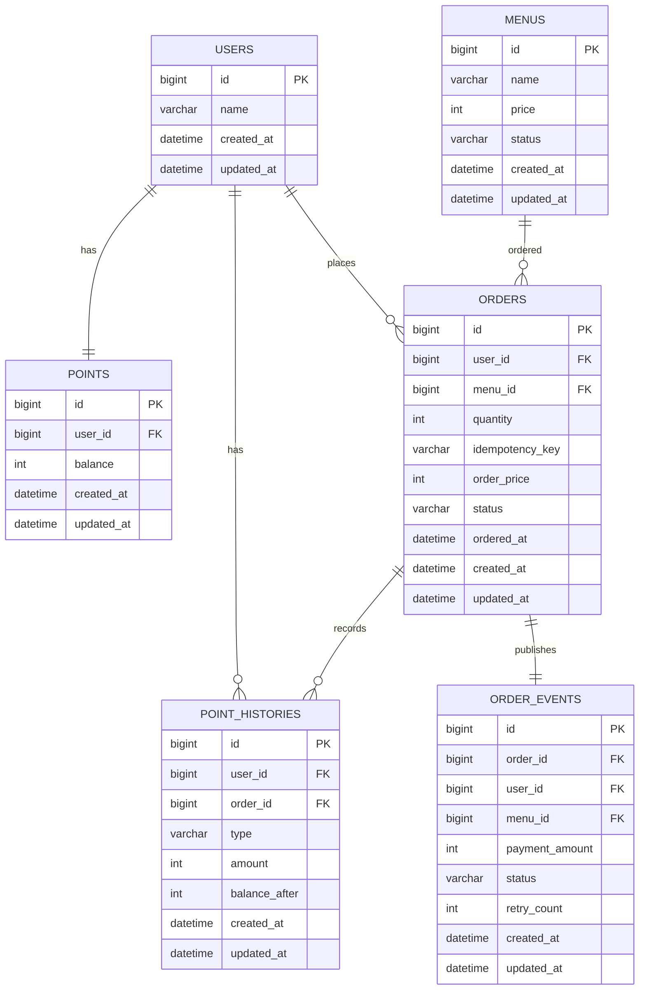

# 데이터 모델

| 테이블 | 책임 | 주요 제약 |
| --- | --- | --- |
| `users` | 사용자 식별 | PK `id` |
| `menus` | 메뉴와 판매 상태 | `price > 0` |
| `points` | 사용자 현재 잔액 | `user_id` unique, `balance >= 0` |
| `point_histories` | 충전 및 사용 근거 | `user_id` FK, 사용 이력만 `order_id` FK (충전 이력은 null) |
| `orders` | 주문 원장과 수량·총 결제금액 스냅샷 | `quantity > 0`, `(user_id, idempotency_key)` unique |
| `order_events` | Kafka 발행 Outbox | `order_id` unique로 주문과 1:1, 이번 범위의 초기 상태는 `PENDING` |

모든 엔티티는 `BaseEntity`를 상속하여 `created_at`, `updated_at`을 공통으로 관리한다.

상태와 유형은 Java enum을 `@Enumerated(EnumType.STRING)`으로 저장한다. DB 컬럼 타입은 `VARCHAR`다.

주요 인덱스는 `points(user_id)`, `orders(user_id, idempotency_key)`, `orders(status, ordered_at)`, `order_events(status, created_at)`를 기준으로 검토한다.
