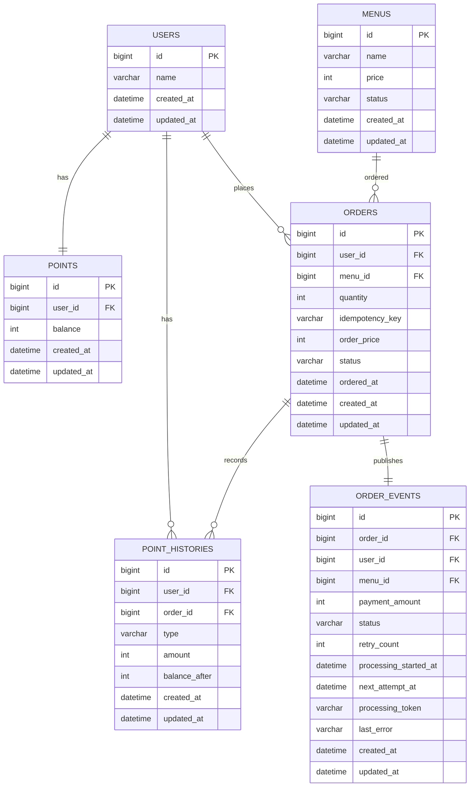

# 데이터 모델

| 테이블 | 책임 | 주요 제약 |
| --- | --- | --- |
| `users` | 사용자 식별 | PK `id` |
| `menus` | 메뉴와 판매 상태 | `price > 0` |
| `points` | 사용자 현재 잔액 | `user_id` unique, `balance >= 0` |
| `point_histories` | 충전 및 사용 근거 | `user_id` FK, 사용 이력만 `order_id` FK (충전 이력은 null) |
| `orders` | 주문 원장과 수량·총 결제금액 스냅샷 | `quantity > 0`, `(user_id, idempotency_key)` unique |
| `order_events` | Kafka 발행 Outbox | `order_id` unique로 주문과 1:1, `PENDING/PROCESSING/SENT/FAILED` 상태와 재시도·선점 정보를 보관 |

모든 엔티티는 `BaseEntity`를 상속하여 `created_at`, `updated_at`을 공통으로 관리한다.

상태와 유형은 Java enum을 `@Enumerated(EnumType.STRING)`으로 저장한다. DB 컬럼 타입은 `VARCHAR`다.

주요 인덱스는 `points(user_id)`, `orders(user_id, idempotency_key)`, `orders(status, ordered_at)`, `order_events(status, next_attempt_at, id)`, `order_events(processing_token)`를 사용한다.

## 인기 메뉴 Redis 파생 데이터

인기 메뉴의 정확성 원장은 위 `orders` 테이블이다. Redis는 DB 테이블이나 추가 Flyway 스키마가 아닌 조회용 파생 저장소로 다음 키를 사용한다.

| 키 | 의미 |
| --- | --- |
| `coffee:ranking:{yyyy-MM-dd}` | 일자별 메뉴 ZSET, score는 주문 횟수 |
| `coffee:ranking:count:{yyyy-MM-dd}` | Consumer가 처리한 해당 일자 주문 건수 |
| `coffee:ranking:status:{yyyy-MM-dd}` | 일자 집계 완료 상태 `DATA` 또는 `EMPTY` |
| `coffee:ranking:processed:{eventId}` | eventId 중복 소비 마커 |

Consumer는 새 eventId의 마커·ZSET·처리 건수·상태·TTL을 한 Lua 연산으로 기록한다. 조회는 7개 일자의 ZSET·상태·처리 건수를 원자 snapshot으로 읽고, `orders.status = 'PAID'` 일자별 건수와 비교한다. 불일치 시 기존 재구성 잠금으로 위 파생 키를 원장 기준으로 복원하며, 인덱스는 실제 집계 쿼리와 실행 계획을 확인하기 전에는 추가하지 않는다.
